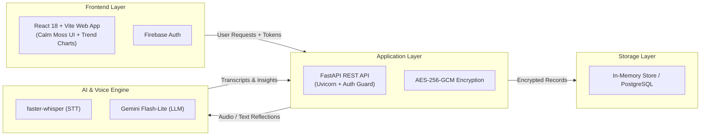
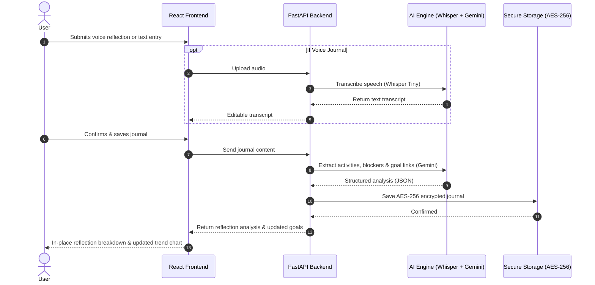

# AI Goal Journal & Accountability Coach

<p align="center">
  <strong>Transform natural voice and text reflections into structured milestones, actionable habits, and automated accountability coaching.</strong>
</p>

<p align="center">
  
  
  
  
  
  
  
  
</p>

---

## Overview

Traditional productivity applications require tedious manual bookkeeping: checking boxes, adjusting sliders, and categorizing tasks into rigid spreadsheets.

**AI Goal Journal & Accountability Coach** completely removes tracking friction. Users reflect naturally—either by speaking through their microphone or typing conversationally. The platform leverages private on-device speech-to-text and Google Gemini structured reasoning to extract completed activities, future plans, active blockers, sentiment trends, and milestone progress. It automatically aligns your daily narrative with long-term goals, calculates progress velocity, prioritizes upcoming deadlines, and generates automated coaching suggestions.

All sensitive personal reflections and coaching records are cryptographically protected at rest using authenticated **AES-256-GCM** envelope encryption with automated zero-downtime key rotation and migration tools.

---

## Key Features

### 🎙️ Dual Voice & Text Conversational Journaling
- **Edge Speech Recognition**: Embedded `faster-whisper` (Tiny model, INT8 quantized on CPU) provides low-latency, zero-cost audio transcription directly on your local system without transmitting raw audio to third-party APIs.
- **Ephemeral Audio Lifecycle**: Uploaded audio is transcribed in temporary memory and wiped immediately after processing.
- **In-Place AI Synthesis**: Smooth transition from entry drafting to structured extraction, summarizing mood, achievements, future tasks, and friction points.

### 🎯 Smart Goal Management & "Focus Next" Intelligence
- **Deterministic Alignment**: Extracted activities are token-matched against active goals to prevent duplicate milestones and ensure accurate tracking.
- **Dynamic Prioritization**: Automated classification into **High**, **Medium**, or **Low** priority based on deadline proximity, current percentage, and stalled states.
- **"Focus Next" Recommendations**: Recommends the highest-leverage goal to tackle next with contextual rationale and a clear action item.
- **Milestone Celebrations**: Completion triggers synchronized 100% progress markers and celebratory confetti animations.

### 📈 Historical Progress Analytics & Trend Visualization
- **Real-Time Dashboard Trend Curve**: Responsive pure-SVG trend chart embedded directly in the main Dashboard and Progress page.
- **Momentum Metrics**: Tracks net milestone change, update-by-update deltas, and overall trajectory (`Improving`, `Stagnant`, or `Declining`).
- **Goal Switcher**: Inspect historical progress trajectories across individual goals with instant visual feedback.

### 📅 Habit Tracker with Weekly Sequence & Streaks
- **Monday–Sunday Grid Sequence**: Track habit routines with formatted ordinal dates (e.g. `21st`).
- **Streak Calculation**: Continuous daily streak momentum tracking with optimistic instant check-offs.
- **Week Navigation**: Effortlessly navigate past and upcoming weeks to audit habit consistency over time.

### 🛡️ Enterprise-Grade Security & Field-Level Encryption
- **AES-256-GCM Authenticated Encryption**: Sensitive journal entries and weekly coaching suggestions are stored as authenticated envelopes (`enc:v1:...`).
- **Zero-Knowledge AI in RAM**: Plaintext is held transiently in process memory only for the duration of model execution and never written unencrypted to storage.
- **Operational Data Migration**: Automated, idempotent batch migration service and CLI (`migrate_existing_data.py`) supporting live and `--dry-run` audits.
- **Zero-Downtime Key Rotation**: Dedicated `KeyRotationManager` enabling seamless key changes with multi-key backward compatibility.

### ⚡ Deterministic Personal Productivity Score (0–100)
- Auditable multi-factor formula combining:
  - **Goal Progress Contribution** ($30\%$)
  - **Goal Completion Ratio** ($20\%$)
  - **Completed Activity Volume** ($20\%$, target: 10/wk)
  - **Journaling Consistency** ($30\%$, target: 5 days/wk)
  - **Blocker Penalties** ($-3$ pts per active blocker, up to $-15$ pts)

---

## System Architecture



---

## Data Flow & Processing Lifecycle



---

## Technology Stack

| Domain | Technology | Version / Configuration | Purpose |
| :--- | :--- | :--- | :--- |
| **Frontend** | React | `18.2.0` | Declarative component UI |
| **Build Tool** | Vite | `5.0.0` | Ultra-fast HMR and bundle compilation |
| **Styling** | Tailwind CSS | `3.4.0` | Custom Calm Moss aesthetic (`paper`, `ink`, `moss`, `ember`) |
| **Icons & Motion** | Lucide React / Anime.js | Latest | Clean iconography and micro-interactions |
| **Backend** | FastAPI | `0.110+` | Asynchronous Python REST API framework |
| **Server** | Uvicorn | `0.28+` | High-performance ASGI production server |
| **Schemas** | Pydantic | `v2` | Strict data validation and typed serialization |
| **Authentication** | Firebase Auth | Web SDK v10 | Client tokens + server-side JWT verification |
| **Speech-to-Text** | `faster-whisper` | Model: `tiny`, INT8, CPU | Local private STT with zero API cost |
| **AI Engine** | Google Gemini API | `gemini-3.1-flash-lite` | Structured activity & sentiment extraction |
| **Cryptography** | `cryptography` | AES-256-GCM | Authenticated field-level envelope encryption |
| **Persistence** | In-Memory / SQLAlchemy | Python 3.10+ / ORM | Thread-safe isolated storage with SQL compatibility |

---

## Project Structure

```text
AI-GOAL-JOURNAL/
├── public/                       # Static public assets & brand icons
├── src/                          # React Single Page Application (SPA)
│   ├── animations/               # Animation presets (motion.js)
│   ├── assets/                   # Bundled brand assets
│   ├── components/               # Reusable UI components:
│   │   ├── TrendChart.jsx        # Responsive SVG progress trend chart
│   │   ├── GoalCalendar.jsx      # Interactive deadline & activity calendar
│   │   ├── GoalCelebration.jsx   # Confetti celebration overlays
│   │   ├── LoadingSkeleton.jsx   # Polished layout skeleton loaders
│   │   ├── Sidebar.jsx           # App navigation sidebar
│   │   └── VoiceRecorder.jsx     # Audio recorder widget
│   ├── context/                  # React Contexts (AuthContext, DataContext, ModalContext)
│   ├── pages/                    # Views:
│   │   ├── Dashboard.jsx         # Momentum metrics, Focus Next, & Progress Trend
│   │   ├── Journal.jsx           # Dual voice/text journaling & in-place analysis
│   │   ├── Goals.jsx             # Smart goal management & priority filters
│   │   ├── Habits.jsx            # Monday-Sunday habit tracker & streaks
│   │   ├── progress.jsx          # Dedicated detailed progress history & analytics
│   │   ├── AiCoach.jsx           # Weekly accountability synthesis reports
│   │   ├── Login.jsx             # Firebase login
│   │   └── Register.jsx          # Firebase user registration
│   ├── services/                 # API client wrapper (api.js) & Firebase auth service
│   ├── App.jsx                   # React Router DOM routing declarations
│   └── index.css                 # Calm Moss theme tokens & Tailwind directives
├── backend/                      # FastAPI Python Application
│   ├── app/
│   │   ├── api/v1/               # API Routers:
│   │   │   ├── journals.py       # Journal CRUD & speech-to-text pipeline
│   │   │   ├── goals.py          # Goal CRUD & Focus Next recommendation
│   │   │   ├── progress.py       # Progress recording, history & trend API
│   │   │   ├── habits.py         # Habit management & daily completions
│   │   │   ├── summaries.py      # Weekly AI accountability synthesis
│   │   │   └── productivity.py   # Personal Productivity Score (0-100) API
│   │   ├── core/                 # Core utilities:
│   │   │   ├── auth.py           # Firebase ID token verification dependency
│   │   │   ├── config.py         # Application settings & environment variables
│   │   │   ├── crypto.py         # AES-256-GCM FieldEncryptionService
│   │   │   └── key_rotation.py   # Zero-downtime key rotation manager
│   │   ├── database/             # SQLAlchemy ORM models & database session setup
│   │   ├── models/               # Domain entity representations
│   │   ├── repositories/         # Thread-safe in-memory & PostgreSQL repositories
│   │   ├── schemas/              # Pydantic v2 validation models
│   │   ├── services/             # Domain business services:
│   │   │   ├── goal_service.py   # Priority calculation & Focus Next engine
│   │   │   ├── journal_service.py# AI extraction & encrypted persistence
│   │   │   ├── progress_service.py# Historical trend calculation & deltas
│   │   │   ├── migration_service.py# DataEncryptionMigrator for legacy data
│   │   │   ├── whisper_service.py# Local faster-whisper Tiny STT singleton
│   │   │   └── gemini_service.py # Google Gemini API structured prompt engine
│   │   └── main.py               # FastAPI application factory, CORS & routers
│   ├── scripts/                  # Operational CLI tools:
│   │   └── migrate_existing_data.py # Batch encryption migration runner
│   ├── tests/                    # Automated pytest test suite:
│   │   ├── test_migration.py     # Encryption migration & idempotency tests
│   │   ├── test_security_regression.py # BOLA, key safety, & tamper resistance
│   │   ├── test_encryption.py    # Field encryption, decryption & rotation tests
│   │   ├── test_progress_trends.py# Progress history deltas & prioritization rules
│   │   ├── test_auto_goals.py    # Goal deduplication & auto-creation tests
│   │   └── test_unit.py          # Isolation & endpoint contract tests
│   └── requirements.txt          # Python dependencies
├── AGENTS.md                     # Universal agent contract & DOX guidelines
├── README.md                     # Project documentation
└── package.json                  # Frontend dependencies and build scripts
```

---

## Getting Started

### Prerequisites
- **Python**: `3.10` or higher
- **Node.js**: `18.0.0` or higher (with `npm`)
- **Google Gemini API Key**: [Get an API Key](https://aistudio.google.com/)
- **Firebase Project**: [Firebase Console](https://console.firebase.google.com/) with Email/Password Authentication enabled

---

### Step 1: Configure Environment Variables

Create a `.env` file in the project root by copying the template below:

```env
# -----------------------------------------------------------------------------
# Google Gemini API
# -----------------------------------------------------------------------------
GEMINI_API_KEY=your_gemini_api_key_here
GEMINI_MODEL=gemini-3.1-flash-lite

# -----------------------------------------------------------------------------
# Whisper Speech-to-Text Configuration
# -----------------------------------------------------------------------------
WHISPER_MODEL=tiny
WHISPER_DEVICE=cpu
WHISPER_COMPUTE_TYPE=int8

# -----------------------------------------------------------------------------
# Security & Cryptography (AES-256-GCM)
# -----------------------------------------------------------------------------
ENCRYPTION_KEY=ai-goal-journal-default-secret-dev-key-change-in-prod
ENCRYPTION_OLD_KEYS=

# -----------------------------------------------------------------------------
# Firebase Authentication
# -----------------------------------------------------------------------------
FIREBASE_PROJECT_ID=your-firebase-project-id
VITE_FIREBASE_API_KEY=your_firebase_web_api_key
VITE_FIREBASE_AUTH_DOMAIN=your-firebase-project.firebaseapp.com
VITE_FIREBASE_PROJECT_ID=your-firebase-project-id
VITE_FIREBASE_STORAGE_BUCKET=your-firebase-project.appspot.com
VITE_FIREBASE_MESSAGING_SENDER_ID=your_sender_id
VITE_FIREBASE_APP_ID=your_app_id
```

---

### Step 2: Start the Backend API

1. Open a terminal in the project root:
   ```bash
   python -m pip install -r backend/requirements.txt
   ```
2. Start the FastAPI server using Uvicorn:
   ```bash
   python -m uvicorn app.main:app --app-dir backend --port 8000 --reload
   ```
3. Verify backend connectivity:
   - **Interactive Swagger Docs**: [http://localhost:8000/docs](http://localhost:8000/docs)
   - **Health Check**: [http://localhost:8000/api/v1/health](http://localhost:8000/api/v1/health)

---

### Step 3: Start the Frontend Application

1. Open a second terminal in the project root:
   ```bash
   npm install
   ```
2. Start the Vite development server:
   ```bash
   npm run dev
   ```
3. Open your browser:
   - **Web Application**: [http://localhost:5173](http://localhost:5173)

---

## Security & Data Migration

### Field-Level Encryption Standard
User reflections and coaching records are protected using authenticated **AES-256-GCM**:
- Nonce: 12-byte cryptographically secure random value generated per encryption.
- Authentication Tag: 16-byte GCM tag verifying payload integrity and authenticating the sender.
- Envelope Serialization: `enc:v1:<base64(nonce + ciphertext + tag)>`.

### Running Data Migration CLI
To audit or migrate legacy unencrypted records to AES-256-GCM ciphertext, use the operational migration script:

```bash
# 1. Audit unencrypted records (Read-Only Dry Run)
python backend/scripts/migrate_existing_data.py --dry-run

# 2. Execute live migration
python backend/scripts/migrate_existing_data.py --verbose
```

---

## Automated Test Suite

The backend includes comprehensive test coverage verifying cryptography, authorization isolation, progress calculations, and automated migrations:

```bash
# Run all automated backend tests
python -m pytest backend/tests/ -v

# Run migration tests specifically
python -m pytest backend/tests/test_migration.py -v

# Run security regression tests
python -m pytest backend/tests/test_security_regression.py -v
```

### Key Test Suites:
- **`test_migration.py`**: Validates dry-run safety, live migration, and double-encryption prevention idempotency.
- **`test_security_regression.py`**: Verifies BOLA tenant isolation (User A vs User B), corrupted key handling, and zero-knowledge Gemini RAM processing.
- **`test_encryption.py`**: Tests AES-256-GCM roundtrips, envelope tamper resistance, and zero-downtime key rotation.
- **`test_progress_trends.py`**: Validates progress delta tracking, trend direction classification, and smart priority rules.
- **`test_auto_goals.py`**: Tests fuzzy goal deduplication and automatic goal generation from journal text.

---

## Contributing & Development Principles

- **Security First**: Secrets must never be committed to source control or exposed to client JavaScript.
- **Privacy by Design**: Sensitive fields must always be encrypted at rest and decrypted only transiently in RAM.
- **Calm Moss Design**: Maintain consistent typographic hierarchy with `Fraunces` serif headings, `Inter` body text, and tailored Tailwind color tokens (`paper`, `ink`, `moss`, `ember`, `line`).
- **Dependency Isolation**: Zero mandatory external database daemon requirements for local development.
