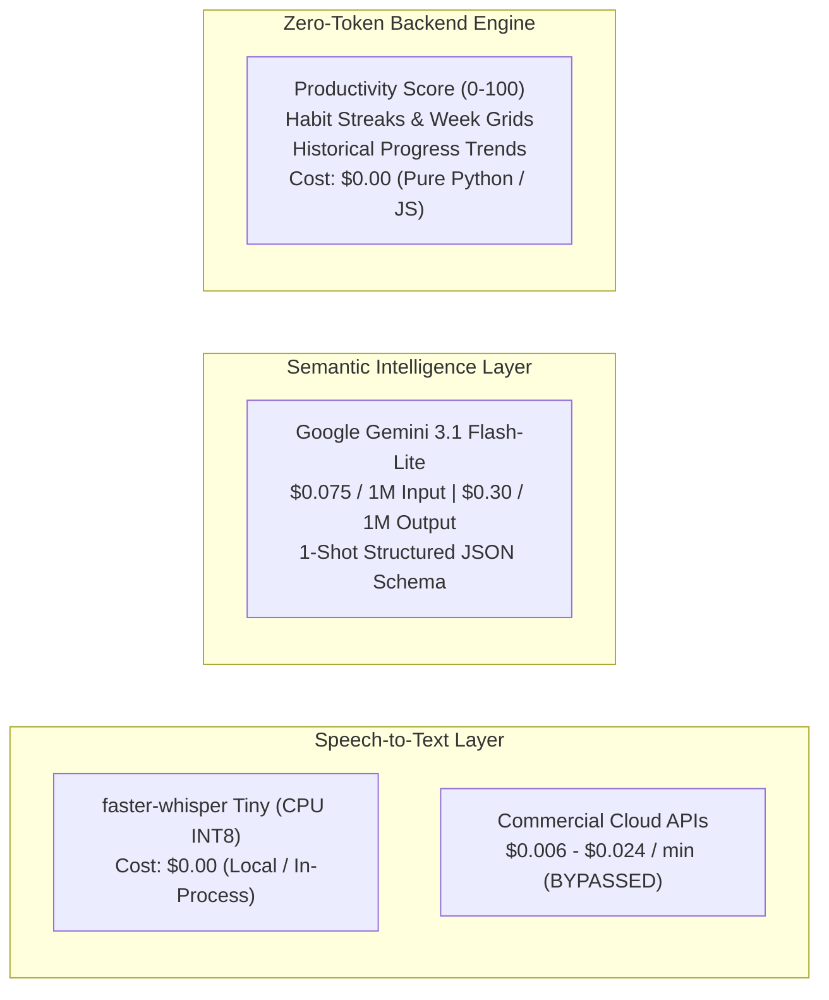

# API, Model & Local Execution Cost Analysis

> **AI Goal Journal & Accountability Coach**  
> *Documentation Directory*: `docs/COST_ANALYSIS.md`  
> *Focus*: Google Gemini API Tokens, faster-whisper Speech-to-Text, Local Hardware Profiling, Firebase Auth, and Cost Optimization Guardrails  
> *Target*: Local MVP $\rightarrow$ Enterprise Scale (100k MAU)  
> *Last Updated*: September 2026

---

## 1. Executive Cost Architecture

The AI Goal Journal's computational architecture was intentionally engineered to maximize margin and eliminate recurring vendor dependencies. By delegating audio processing to local CPU hardware and utilizing Google's most cost-efficient generative model, marginal API costs are under **$0.0031 per active user per month**:

---

## 2. Local Execution & Development Resource Footprint

The system is strictly designed to operate within a **4 GB RAM PC Constraint**, requiring zero GPU or cloud dependencies during local development.

### 2.1 Memory & CPU Consumption Profile

| Component | Technology | Idle RAM | Active Load RAM | CPU Utilization (Burst) | Monthly Cost |
| :--- | :--- | :--- | :--- | :--- | :--- |
| **FastAPI Backend** | Python 3.10+ / Uvicorn | ~75 MB | ~90 MB | < 2% | **$0.00** |
| **Speech-to-Text** | `faster-whisper` Tiny (INT8 CPU) | ~0 MB (lazy) | ~210 MB (peak) | 15% – 30% for ~1.5s | **$0.00** |
| **Frontend Dev Server** | Vite 5 / Node.js 18+ | ~50 MB | ~65 MB | < 1% | **$0.00** |
| **Data Layer** | In-Memory Repository Layer | ~5 MB | ~15 MB (10k items) | < 1% | **$0.00** |
| **Field Cryptography** | AES-256-GCM (`cryptography`) | ~0 MB | ~1 MB | < 0.1ms per entry | **$0.00** |
| **Total System Footprint** | Complete Local Stack | **~130 MB** | **~381 MB** | **Negligible** | **$0.00** |

*Key finding: The entire application consumes less than 10% of available RAM on a 4 GB RAM workstation, requiring 0 GPU or CUDA drivers.*

---

## 3. Speech-to-Text Cost Analysis: Local Whisper vs Commercial APIs

A cornerstone of the application's cost posture is running `faster-whisper` (Tiny model, INT8 quantized on CPU) as an in-process singleton.

### 3.1 Commercial Cloud STT Pricing vs faster-whisper

| Speech-to-Text Provider | Model / Tier | Pricing per Minute | Cost per 1,000 Audio Mins | Audio Retention Policy |
| :--- | :--- | :--- | :--- | :--- |
| **Local `faster-whisper`** | **Tiny (CPU INT8)** | **$0.00 / min** | **$0.00** | **Ephemeral (deleted immediately)** |
| OpenAI Whisper API | `whisper-1` | $0.006 / min | $6.00 | Retained up to 30 days |
| Google Cloud Speech-to-Text | Standard V2 | $0.016 / min | $16.00 | Cloud logging options |
| AssemblyAI | Conformer-2 | $0.011 / min | $11.00 | Cloud storage buffer |
| Amazon Transcribe | Standard | $0.024 / min | $24.00 | S3 bucket storage |

### 3.2 Projected Savings from Embedded Whisper

Assuming each user records **30 minutes of voice journaling per month**:

| Active User Count | Total Voice Minutes / Month | OpenAI Whisper API Cost | Google Cloud STT Cost | Our In-Process Cost | Annual Savings (vs OpenAI) |
| :--- | :--- | :--- | :--- | :--- | :--- |
| **100 MAU** | 3,000 mins | $18.00 / mo | $48.00 / mo | **$0.00** | **$216 / year** |
| **1,000 MAU** | 30,000 mins | $180.00 / mo | $480.00 / mo | **$0.00** | **$2,160 / year** |
| **10,000 MAU** | 300,000 mins | $1,800.00 / mo | $4,800.00 / mo | **$0.00** | **$21,600 / year** |
| **50,000 MAU** | 1,500,000 mins | $9,000.00 / mo | $24,000.00 / mo | **$0.00** | **$108,000 / year** |
| **100,000 MAU** | 3,000,000 mins | $18,000.00 / mo | $48,000.00 / mo | **$0.00** | **$216,000 / year** |

---

## 4. Google Gemini API (`gemini-3.1-flash-lite`) Token Mathematics

Google Gemini `gemini-3.1-flash-lite` delivers near-instant structured extraction with industry-leading token affordability:
- **Input Tokens**: **$0.075 per 1,000,000 tokens** ($0.000000075 / token)
- **Output Tokens**: **$0.30 per 1,000,000 tokens** ($0.00000030 / token)
- **Free Tier Quota**: 15 RPM, 1,000,000 TPM, 1,500 requests / day (free of charge for prototype / testing).

### 4.1 Daily Journal Submission (1-Shot Structured Extraction)

Every journal submission (whether text or transcribed voice) executes **exactly 1 structured extraction call**:
- **System Prompt & Goal Context**: ~350 tokens (instructs Gemini to classify sentiment, extract discrete completed vs planned activities, identify blockers with categories, and match with active goals).
- **User Journal Content**: ~200 tokens (average ~150 words).
- **Total Input Tokens**: **~550 tokens**.
- **Structured JSON Output**: ~250 tokens (schema conforms to `AIJournalAnalysis`).

$$\text{Input Cost} = \frac{550}{1,000,000} \times \$0.075 = \$0.00004125$$

$$\text{Output Cost} = \frac{250}{1,000,000} \times \$0.30 = \$0.000075$$

$$\mathbf{\text{Total Cost per Journal Entry}} = \mathbf{\$0.00011625 \ (\approx \$0.116 \text{ per 1,000 entries})}$$

### 4.2 Weekly AI Accountability Coach Summary (On-Demand)

Synthesized exclusively when the user requests coaching on the AI Coach page:
- **Input Context**: ~1,800 tokens (up to 7 days of recent journal reflections, categorized blockers, and goal velocity).
- **Output Tokens**: ~400 tokens (executive headline, wins, recurring blocker insights, and tailored accountability action steps).

$$\text{Cost per Weekly Report} = \left(\frac{1,800}{1,000,000} \times \$0.075\right) + \left(\frac{400}{1,000,000} \times \$0.30\right) = \$0.000135 + \$0.000120 = \mathbf{\$0.000255}$$

### 4.3 Average Monthly AI Expense per Active User

Assuming an active user submits **20 journal entries/month** and requests **3 weekly coaching summaries/month**:

$$\text{Monthly Gemini Cost per User} = (20 \times \$0.00011625) + (3 \times \$0.000255) = \mathbf{\$0.003085 \text{ / user / month}}$$

*(Approximately 0.31 cents per active user per month).*

---

## 5. Firebase Authentication & Security Pricing

| Service Layer | Plan / Technology | Free Tier Threshold | Overage Unit Cost | Notes |
| :--- | :--- | :--- | :--- | :--- |
| **Firebase Auth** | Spark Plan | 50,000 Monthly Active Users | Free ($0.00) | Email/Password & Google Sign-In |
| **Firebase Auth** | Blaze Plan | First 50,000 MAUs free | **$0.0055 per MAU** | Beyond 50,000 MAU threshold |
| **Token Verification** | Google Public Certs (`app/core/auth.py`) | Unlimited | **$0.00** | Decoded and verified locally in Python |
| **Field Encryption** | AES-256-GCM Envelope Encryption | Unlimited | **$0.00** | In-memory cryptographic CPU operations |

---

## 6. Cumulative API & Intelligence Cost at Scale

The following table models pure **API & Model costs** across growth milestones:

| Active Users (MAU) | Monthly Journals | Monthly Summaries | Gemini AI Cost | faster-whisper Cost | Firebase Auth Cost | Total Monthly API Cost | Cost / User / Mo |
| :--- | :--- | :--- | :--- | :--- | :--- | :--- | :--- |
| **100 MAU** | 2,000 | 300 | $0.00 *(Free Tier)* | $0.00 | $0.00 | **$0.00** | **$0.0000** |
| **1,000 MAU** | 20,000 | 3,000 | $3.09 | $0.00 | $0.00 | **$3.09** | **$0.0031** |
| **10,000 MAU** | 200,000 | 30,000 | $30.85 | $0.00 | $0.00 | **$30.85** | **$0.0031** |
| **50,000 MAU** | 1,000,000 | 150,000 | $154.25 | $0.00 | $0.00 | **$154.25** | **$0.0031** |
| **100,000 MAU** | 2,000,000 | 300,000 | $308.50 | $0.00 | $50.00 *(overage)* | **$358.50** | **$0.0036** |

---

## 7. Token & API Cost Guardrails

To prevent unexpected token spikes or wasteful spend, the application enforces these design rules:

1. **Deterministic Rule-Based Computations (0 LLM Tokens)**:
   - **Productivity Score (0–100)**: Evaluated using a deterministic multi-factor mathematical formula (`app/services/productivity_service.py`).
   - **Progress Trends**: Trend direction (`Improving`, `Stagnant`, `Declining`) and milestone deltas are calculated in Python/SQL.
   - **Habit Streaks**: Weekly sequences (Monday–Sunday) and streaks are tracked mathematically.
2. **Strict 1-Shot Extraction Policy**: Journal entries are processed in a single prompt that requests sentiment, activities, blockers, and goal hints in one pass.
3. **On-Demand Coaching Reports**: Weekly summaries are never scheduled via automated cron jobs. They run strictly when requested by the user and are stored for instant retrieval.
4. **Context Window Pruning**: Gemini prompt builders only inject active goals (`status == 'active'`). Completed and archived goals are omitted, reducing prompt token count by ~40%.
5. **Zero Cloud Audio Storage**: Temporary audio files are created in ephemeral storage and deleted inside Python `try...finally` blocks, eliminating cloud object storage fees.
